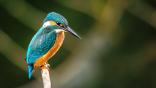
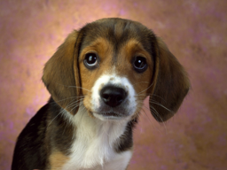
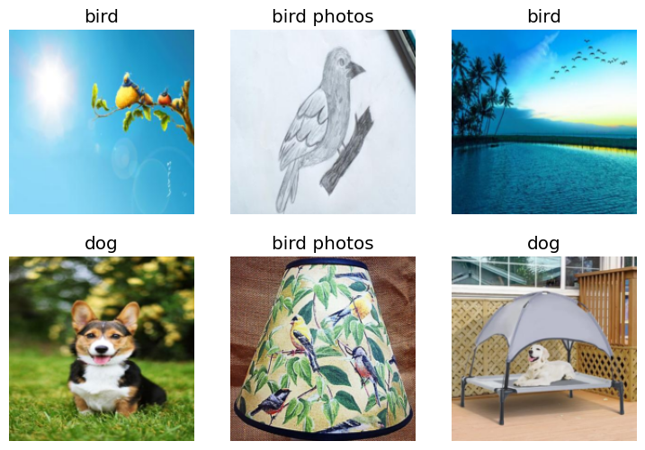

***Fine-tune resnet18 with a few bird and dog photos to make a bird classifier***

Use fastbook to grab photos with duckduckgo api...

```python
from fastbook import *

def search_images(term, max=30):
  print(f"Searching for '{term}'")
  return search_images_ddg(term, max_images=max)

urls = search_images_ddg('bird photos', max_images=1)
urls[0]
```


    'https://wallpapercave.com/wp/wp7039045.jpg'


Use 'download_url' function from 'fastdownload' module to save the image locally. Open and view it..


```python
from fastdownload import download_url
dest = 'bird.jpg'
download_url(urls[0], dest, show_progress=False)

from fastai.vision.all import *
im = Image.open(dest)
im.to_thumb(256,256)
```


    

    


```python
download_url(search_images_ddg('dog photos', max_images=1)[0], 'dog.jpg', show_progress=False)
Image.open('dog.jpg').to_thumb(256,256)
```


    

    


```python
# Define a tuple of search terms. These will be used to search for images
searches = 'dog', 'bird'
# Use Path function to define location
path = Path('bird_or_not')
# Give api extra time
from time import sleep
# Iterate over the searches tuple
for o in searches:
  # Create unique folder for each search term in the tuple
  dest = (path/o) # bird_or_not/{'dog', 'bird'}
  # Use mkdir to create the directory. exist_ok=True means it won't throw an error if the directory already exists. Parents=True means it will create the parent directory if it doesn't exist
  dest.mkdir(exist_ok=True, parents=True)

  download_images(dest, urls=search_images(f'{o} photo'))
  sleep(10)
  download_images(dest, urls=search_images(f'{o} sun photo'))
  sleep(10)
  download_images(dest, urls=search_images(f'{o} shade photo'))
  sleep(10)
  resize_images(path/o, max_size=400, dest=path/o)
```

    Searching for 'dog photo'
    Searching for 'dog sun photo'
    Searching for 'dog shade photo'
    Searching for 'bird photo'
    Searching for 'bird sun photo'
    Searching for 'bird shade photo'


```python
# Check data set for failed downloads
failed = verify_images(get_image_files(path))
failed.map(Path.unlink)
len(failed)
```


    6


```python
# Use `DataLoaders` to train the model. It's an object that contains
# a training set (images used to create model) and a validation set(
# images used to check accurcacy of model). The `DataBlock` function gives
# us this functionalitly.
dls = DataBlock(
  blocks=(ImageBlock, CategoryBlock), # inputs to model are images, outputs are categories
  get_items=get_image_files, # grab all images in the path
  splitter=RandomSplitter(valid_pct=0.2, seed=42), # split data into
  # training and validation sets randomly, using 20% for validation
  get_y=parent_label, # label is name of parent dir
  item_tfms=[Resize(192, method='squish')] # resize each
).dataloaders(path, bs=32) # bs==batch size

dls.show_batch(max_n=6)
```


    

    


```python
# train using computer vision model resnet18. Use fastai's fine_tune
# which auto sets best practices for fine tuning a pre trained model
# 'fine-tuning' means starting with a model soemone else trained with
# another dataset and adjusting the params so it works with your dataset

learn = vision_learner(dls, resnet18, metrics=error_rate)
learn.fine_tune(3)
```

<table border="1" class="dataframe">
  <thead>
    <tr style="text-align: left;">
      <th>epoch</th>
      <th>train_loss</th>
      <th>valid_loss</th>
      <th>error_rate</th>
      <th>time</th>
    </tr>
  </thead>
  <tbody>
    <tr>
      <td>0</td>
      <td>1.906563</td>
      <td>1.569970</td>
      <td>0.531915</td>
      <td>00:02</td>
    </tr>
  </tbody>
</table>

<table border="1" class="dataframe">
  <thead>
    <tr style="text-align: left;">
      <th>epoch</th>
      <th>train_loss</th>
      <th>valid_loss</th>
      <th>error_rate</th>
      <th>time</th>
    </tr>
  </thead>
  <tbody>
    <tr>
      <td>0</td>
      <td>1.195720</td>
      <td>2.022968</td>
      <td>0.606383</td>
      <td>00:03</td>
    </tr>
    <tr>
      <td>1</td>
      <td>1.110270</td>
      <td>2.487636</td>
      <td>0.638298</td>
      <td>00:02</td>
    </tr>
    <tr>
      <td>2</td>
      <td>1.021070</td>
      <td>2.499106</td>
      <td>0.648936</td>
      <td>00:02</td>
    </tr>
  </tbody>
</table>


```python

# Use the fine-tuned resnet18 to predict bird
is_bird,_,probs = learn.predict(PILImage.create('bird.jpg'))
# show 'bird.jpg'
print(f"This is a: {is_bird}.")
print(f"Probability it's a bird: {probs[0]:.4f}")
Image.open('bird.jpg').to_thumb(256,256)

```


    This is a: bird photos.
    Probability it's a bird: 0.3578


    

